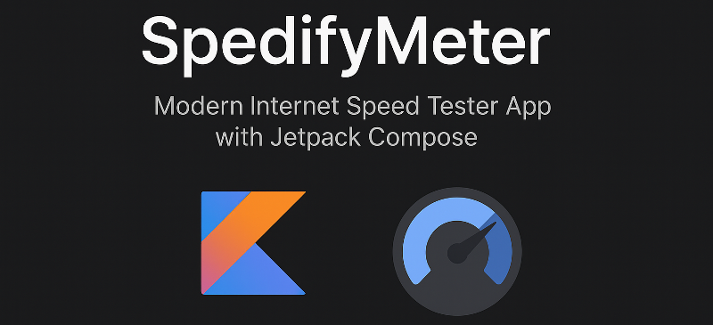

# 🚀 SpedifyMeter – Internet Speed Tester App  



SpedifyMeter is a clean and modern **internet speed tester app** built with **Jetpack Compose** for Android.  
It helps users measure their **download speed, upload speed, and ping latency** in real time with an intuitive **speedometer UI**.  

---

## ✨ Features  
- ⚡ **Real-time Speed Test** – Check download, upload, and ping.  
- 🎯 **Beautiful Speedometer UI** – Powered by Jetpack Compose animations.  
- 📊 **Detailed Results** – Speed history & stats.  
- 🌐 **Accurate Measurements** – Uses modern APIs for precise results.  
- 🌓 **Dark Mode Support** – Seamless UI for all themes.  

---

## 🛠️ Tech Stack  
- **Kotlin**  
- **Jetpack Compose**  
- **Coroutines & Flow**  
- **Material 3 Design**  

---

## 📱 Screenshots  
_Add your app screenshots here_  
  
  

---

## 🚀 Getting Started  

1. Clone the repo  
   ```bash
   git clone https://github.com/your-username/SpedifyMeter.git
2. Open in Android Studio (Giraffe or later)
3. Build & run the app on your device/emulator

---

## 💡Roadmap

 - Save speed test history
 - Export results (CSV/JSON)
 - Support multiple servers for accurate tests
 - Widgets & notifications

## 🤝 Contributing

Contributions, issues, and feature requests are welcome!
Feel free to **fork** the repo and submit a **PR**.

## WhatsApp Channel
Get Kotlin & Android Jetpack Compose tips on `What's App` **Join My Channel** :
[📚 Kotlin & Android Learning📚](https://whatsapp.com/channel/0029VbBGTNr90x2umLoWKU3z)

